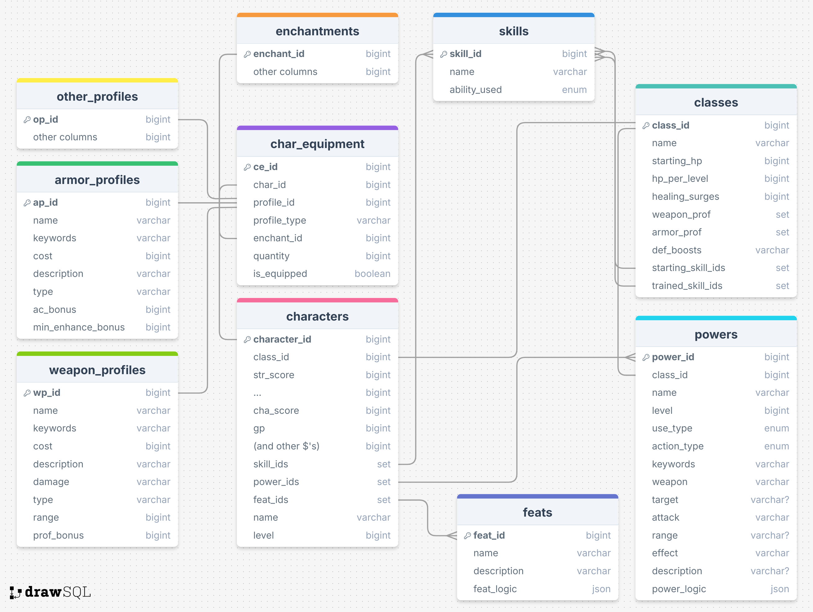

# fremblem-compcon
Dungeons and Dragons 4E Virtual Character Manager

Inspired by the Lancer RPG system's COMP/CON tool, I wanted to build a similar tool for a Dnd 
4e campaign I'm currently running.

This webapp would allow users to perform CRUD operations on characters they've created, and would allow them to access this data from any device that can access the webapp. It'll also include a "combat mode" that'll hopefully make managing all the fiddly bits of combat easier. In later updates, I intend to add support for managing NPC units *(either player or GM run)* and a Content Manager that would allow for users to upload custom data to be used in their version of the app. After suggestions from my presentation and Teams, I might add an Encounter builder at some point after the app is officially released and running.

Features that still need to be implemented:
- Leveling up *(which is just a modified Character Creation flow)*
- Combat Mode and Logic

Features I'd like to implement:
- Custom Weapon/Feat/Equipment
- NPC Manager
- Content Manager/Ability to add custom content to just your version of the app
- Open Sourcing the core Dnd 4e data jsons
- Encounter builder, which would include adding a whole slew of enemy stats *(either as entries on the NPC table, or a specific Enemy table? That's a bridge I'll cross when I design out this update in the future)*

Here's some of the key take aways I got from this project:
- CSS doesn't have to be agonizingly painful. *(Thanks ChatGPT for recommending Tailwind)*
- It's *really* easy to bite off more than you can chew.
	- When you're designing and implementing the UI, database tables, "business" logic, etc. it takes a lot of time to get things done. You're wearing a lot of hats, and while that gives you all the control over the project, it also is a lot of weight on your shoulders.
- In a similar vein, game design/logic is more complex than you initially think.
	- A lot of the tables I initially created went through three or more redesigns. I thought I had covered all the use cases for something, only to realize as I built out another page or another table, that I was missing a field or two.
- Less isn't always best.
	- When designing equipment, one iteration of those tables had put all the shared attributes between Armor, Weapons, etc. in a parent table that these different equipment types would point to. For example, instead of having a "name" column on each table, there was just one on the parent table that they shared. While this helped keep the specific tables smaller, it was a pain to manually write the JSON files that populated these tables initially. This would be fine for my smaller test set of data, but isn't sustainable in the long run, especially if I want people to be able to write their own JSON files that can be read to add custom equipment.
- If you enjoy the project you're working on, it's a whole lot easier to dump time and effort into.

Entity Relationship Diagram:

Rough System Design:

